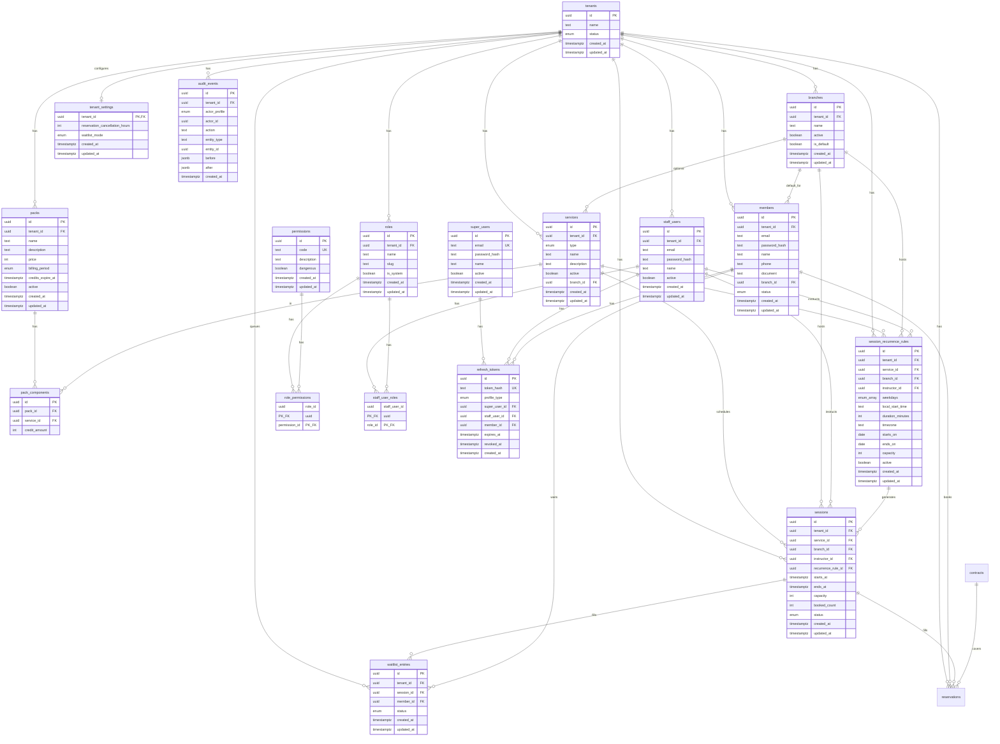

# GymBro — Esquema de base de datos

**Estado:** Viva (se actualiza con cada migración Prisma)  
**Fuente de verdad del código:** [`api/prisma/schema.prisma`](../api/prisma/schema.prisma)  
**Motor:** PostgreSQL 16 · ORM Prisma 6  

Documento **implementado** (tablas reales), no el modelo conceptual de [03-modelo-dominio.md](./03-modelo-dominio.md). Cuando agregues o cambies tablas, actualizá este archivo en la misma tarea.

---

## 1. Convenciones

| Tema | Valor |
|------|--------|
| IDs | `uuid` (`@db.Uuid`) |
| Nombres físicos | `snake_case` vía `@@map` / `@map` |
| Multi-tenant | Tablas de negocio con `tenant_id` → `tenants.id` (RN-TEN-001) |
| Timestamps | `created_at`, `updated_at` donde aplica |
| Soft delete | No (aún); `active` boolean en usuarios / sucursales |
| Migraciones | `api/prisma/migrations/` (manuales en dev) |

---

## 2. Diagrama de relaciones (actual)



---

## 3. Enums

| Enum (Prisma) | Valores | Uso |
|---------------|---------|-----|
| `TenantStatus` | `ACTIVE`, `SUSPENDED` | Estado del gym (RN-TEN-002) |
| `AuthProfileType` | `SUPER`, `STAFF`, `MEMBER` | Dueño del refresh token (RN-ROL-005) |
| `MemberStatus` | `ACTIVE`, `SUSPENDED`, `INACTIVE` | Estado del afiliado (CU-AFI-003) |
| `ServiceType` | `ACCESO_LIBRE`, `POR_SESIONES` | Tipo de servicio (RN-SER-001) |
| `BillingPeriod` | `MONTHLY`, `ONE_TIME` | Periodicidad de cobro del pack |
| `PaymentStatus` | `PENDING`, `APPROVED`, `REJECTED`, `REFUNDED` | Estado de pago (RN-PAG-003) |
| `PaymentMethod` | `STUB`, `CASH` | Medio (MP llega en E5) |
| `ContractStatus` | `ACTIVE`, `EXPIRED`, `CANCELLED`, `REFUNDED` | Estado de contratación |
| `SessionStatus` | `PUBLISHED`, `CANCELLED` | Estado de sesión de calendario |
| `Weekday` | `MONDAY` … `SUNDAY` | Días ISO de recurrencia semanal |
| `ReservationStatus` | `CONFIRMED`, `CANCELLED` | Estado de reserva |
| `ReservationCoverage` | `CREDIT` | Medio (drop-in llega después) |
| `WaitlistMode` | `AUTO_ASSIGN`, `MEMBER_CONFIRM`, `STAFF_CONFIRM` | Liberación cola (RN-RES-005) |
| `WaitlistStatus` | `WAITING`, `PROMOTED`, `LEFT` | Estado ítem de cola |

---

## 4. Tablas

### 4.1 `tenants`

Gimnasio / estudio = tenant SaaS.

| Columna | Tipo | Notas |
|---------|------|--------|
| `id` | uuid PK | |
| `name` | text | |
| `status` | `TenantStatus` | default `ACTIVE` |
| `created_at` | timestamptz | |
| `updated_at` | timestamptz | |

**Relaciones:** 1→N `staff_users`, 1→N `members`, 1→N `branches`, 1→N `roles`, 1→1 `tenant_settings`, 1→N `audit_events`.

---

### 4.2 `branches`

Sucursal / sede (modelo Prisma `Branch`). Estrategia **S2** / RN-TEN-003: multi-sede en datos; MVP opera con 1 sede visible (`is_default`).

| Columna | Tipo | Notas |
|---------|------|--------|
| `id` | uuid PK | |
| `tenant_id` | uuid FK → `tenants` | ON DELETE CASCADE · index |
| `name` | text | seed create: `Sede principal` |
| `active` | boolean | default true |
| `is_default` | boolean | default false |
| `created_at` / `updated_at` | timestamptz | |

**Índice único parcial:** a lo sumo una fila con `is_default = true` por `tenant_id`.

Al `POST /api/tenants` se crea tenant + branch default + roles sistema en la misma transacción. No hay CRUD de sucursales en esta tarea. Tenants anteriores al migrate pueden no tener branch (`defaultBranch: null`).

---

### 4.3 `permissions`

Catálogo **global** de permisos de producto (códigos fijos). Fuente en código: `api/src/roles/permission-catalog.ts`.

| Columna | Tipo | Notas |
|---------|------|--------|
| `id` | uuid PK | |
| `code` | text UK | ej. `members.write`, `payments.refund` |
| `description` | text | |
| `dangerous` | boolean | RN-ROL-007 |
| `created_at` / `updated_at` | timestamptz | |

Se hace upsert al crear un tenant (`RolesSeedService.ensurePermissionCatalog`).

**Flags peligrosos (RN-ROL-007):** el campo `dangerous` marca el permiso. La API exige el código con `@RequirePermission` (p. ej. `roles.write`, `staff.write`). Tener el permiso en algún rol = flag otorgado; no hay tabla aparte. Hoy cableado en rutas Staff de roles/staff; acciones de negocio (refund, pase manual, MP) usarán el mismo guard cuando existan.

---

### 4.4 `roles`

Rol de staff **por tenant** (RN-ROL-002). Seed: `Admin` (`slug=admin`) y `Profesor` (`slug=profesor`), `is_system=true`.

| Columna | Tipo | Notas |
|---------|------|--------|
| `id` | uuid PK | |
| `tenant_id` | uuid FK → `tenants` | ON DELETE CASCADE |
| `name` | text | unique por tenant |
| `slug` | text | unique por tenant |
| `is_system` | boolean | seed no borrable fácilmente |
| `created_at` / `updated_at` | timestamptz | |

---

### 4.5 `role_permissions`

N:N rol ↔ permiso.

| Columna | Tipo | Notas |
|---------|------|--------|
| `role_id` | uuid PK/FK → `roles` | CASCADE |
| `permission_id` | uuid PK/FK → `permissions` | CASCADE |

---

### 4.6 `staff_user_roles`

N:N staff ↔ rol (RN-ROL-004).

| Columna | Tipo | Notas |
|---------|------|--------|
| `staff_user_id` | uuid PK/FK → `staff_users` | CASCADE |
| `role_id` | uuid PK/FK → `roles` | CASCADE |

---

### 4.7 `super_users`

Super Admin de plataforma (sin `tenant_id`, RN-ROL-001).

| Columna | Tipo | Notas |
|---------|------|--------|
| `id` | uuid PK | |
| `email` | text UK | |
| `password_hash` | text | bcrypt |
| `name` | text nullable | |
| `active` | boolean | default true |
| `created_at` / `updated_at` | timestamptz | |

---

### 4.8 `staff_users`

Staff de un gym. Email único **por tenant**.

| Columna | Tipo | Notas |
|---------|------|--------|
| `id` | uuid PK | |
| `tenant_id` | uuid FK → `tenants` | ON DELETE CASCADE · index |
| `email` | text | |
| `password_hash` | text | |
| `name` | text nullable | |
| `active` | boolean | |
| `created_at` / `updated_at` | timestamptz | |

**Unique:** `(tenant_id, email)`.

---

### 4.9 `members`

Afiliado (socio). Perfil separado del staff (RN-ROL-005). Email único **por tenant**. Login solo si `status = ACTIVE`.

| Columna | Tipo | Notas |
|---------|------|--------|
| `id` | uuid PK | |
| `tenant_id` | uuid FK → `tenants` | ON DELETE CASCADE · index |
| `email` | text | |
| `password_hash` | text | |
| `name` | text nullable | |
| `phone` | text nullable | |
| `document` | text nullable | unique por tenant (NULL permitido repetido) |
| `branch_id` | uuid FK → `branches` nullable | ON DELETE SET NULL |
| `status` | `MemberStatus` | default `ACTIVE` |
| `created_at` / `updated_at` | timestamptz | |

**Unique:** `(tenant_id, email)`, `(tenant_id, document)`.

API Staff: `GET|POST|PATCH /api/members`, `PATCH /api/members/:id/status` (`members.deactivate`, dangerous). Super: `/api/tenants/:tenantId/members`.

---

### 4.10 `refresh_tokens`

Refresh opaco hasheado (SHA-256). Un token pertenece a **un** perfil (solo una FK de dueño poblada).

| Columna | Tipo | Notas |
|---------|------|--------|
| `id` | uuid PK | |
| `token_hash` | text UK | |
| `profile_type` | `AuthProfileType` | |
| `super_user_id` | uuid FK nullable | |
| `staff_user_id` | uuid FK nullable | |
| `member_id` | uuid FK nullable | |
| `expires_at` | timestamptz | |
| `revoked_at` | timestamptz nullable | logout / rotación |
| `created_at` | timestamptz | |

---

### 4.11 `audit_events`

EventoAuditoria append-only (RN-ROL-008 / CU-ROL-007). Sin UPDATE/DELETE de negocio.

| Columna | Tipo | Notas |
|---------|------|--------|
| `id` | uuid PK | |
| `tenant_id` | uuid FK → `tenants` nullable | CASCADE · index con `created_at` |
| `actor_profile` | `AuthProfileType` | SUPER o STAFF en práctica |
| `actor_id` | uuid | id del super/staff (sin FK dura) |
| `action` | text | ej. `tenant.update`, `role.create` |
| `entity_type` | text | ej. `tenant`, `role`, `staff_user` |
| `entity_id` | uuid nullable | |
| `before` / `after` | jsonb nullable | snapshot |
| `created_at` | timestamptz | |

API: Staff `GET /api/audit-events?limit=&action=` (`audit.read`); Super `GET /api/tenants/:tenantId/audit-events`. Escritura E1 desde servicios de tenants/roles/staff.

---

### 4.12 `services`

Servicio del catálogo comercial (RN-SER-001 / CU-SER-001).

| Columna | Tipo | Notas |
|---------|------|--------|
| `id` | uuid PK | |
| `tenant_id` | uuid FK → `tenants` | CASCADE · index |
| `type` | `ServiceType` | inmutable tras create |
| `name` | text | |
| `description` | text nullable | |
| `active` | boolean | default true (baja lógica) |
| `branch_id` | uuid FK → `branches` nullable | SET NULL |
| `created_at` / `updated_at` | timestamptz | |

API Staff: `GET|POST|PATCH /api/services` (`catalog.write`). Super: `/api/tenants/:tenantId/services`.

---

### 4.13 `packs`

Pack vendible (CU-SER-002). `price` = pesos enteros ARS. `kind` (`ACCESS`|`CREDITS`|`MIXED`) se **infiere** de componentes (no se persiste).

| Columna | Tipo | Notas |
|---------|------|--------|
| `id` | uuid PK | |
| `tenant_id` | uuid FK → `tenants` | CASCADE |
| `name` | text | |
| `description` | text nullable | |
| `price` | int | pesos enteros |
| `billing_period` | `BillingPeriod` | MONTHLY / ONE_TIME |
| `credits_expire_at` | timestamptz nullable | null = sin vencimiento de catálogo |
| `active` | boolean | default true |
| `created_at` / `updated_at` | timestamptz | |

### 4.14 `pack_components`

| Columna | Tipo | Notas |
|---------|------|--------|
| `id` | uuid PK | |
| `pack_id` | uuid FK → `packs` | CASCADE |
| `service_id` | uuid FK → `services` | RESTRICT |
| `credit_amount` | int nullable | obligatorio ≥1 si servicio `POR_SESIONES`; null si `ACCESO_LIBRE` |

**Unique:** `(pack_id, service_id)`.

API Staff: `GET|POST|PATCH /api/packs`. Super: `/api/tenants/:tenantId/packs`.

---

### 4.15 `payments`

Pago de negocio (RN-PAG-003..005). En MVP staff crea stub/caja ya `APPROVED` junto a la contratación.

| Columna | Tipo | Notas |
|---------|------|--------|
| `id` | uuid PK | |
| `tenant_id` / `member_id` | uuid FK | CASCADE |
| `pack_id` | uuid FK nullable | SET NULL |
| `amount` | int | pesos (copia del pack) |
| `status` | `PaymentStatus` | |
| `method` | `PaymentMethod` | STUB / CASH |
| `idempotency_key` | text | unique por tenant |
| `created_at` / `updated_at` | timestamptz | |

### 4.16 `contracts`

Contratación tras pago aprobado (CU-CON-001).

| Columna | Tipo | Notas |
|---------|------|--------|
| `id` | uuid PK | |
| `tenant_id` / `member_id` / `pack_id` | uuid FK | |
| `payment_id` | uuid FK UK | 1:1 con payment |
| `status` | `ContractStatus` | |
| `starts_at` / `ends_at` | timestamptz | MONTHLY → +1 mes; ONE_TIME → `creditsExpireAt` o null |
| `has_access_libre` | boolean | |

### 4.17 `contract_credit_balances`

| Columna | Tipo | Notas |
|---------|------|--------|
| `contract_id` / `service_id` | uuid FK | unique par |
| `initial_amount` / `remaining` | int | |
| `expires_at` | timestamptz nullable | copia de pack |

API: Staff `POST|GET /api/members/:memberId/contracts`, `GET /api/contracts/:id`, `PATCH /api/contracts/:id/status`; Member `GET /api/me/contracts`.

### 4.18 `session_recurrence_rules`

Regla semanal que materializa sesiones futuras (CU-SER-004 / RN-SER-012).

| Columna | Tipo | Notas |
|---------|------|--------|
| `id` | uuid PK | |
| `tenant_id` / `service_id` / `branch_id` | uuid FK | servicio `POR_SESIONES`; sede activa |
| `instructor_id` | uuid FK → `staff_users` nullable | Profesor default |
| `weekdays` | `Weekday[]` | Días seleccionados |
| `local_start_time` | text `HH:mm` | Hora de pared del gimnasio |
| `duration_minutes` | int | 1..1440 |
| `timezone` | text | IANA, ej. `America/Argentina/Buenos_Aires` |
| `starts_on` / `ends_on` | date | Rango finito máximo 6 meses |
| `capacity` | int | ≥ 1 |
| `active` | boolean | Desactivar no altera sesiones generadas |

API Staff: `GET|POST /api/session-recurrence-rules`, `PATCH /api/session-recurrence-rules/:id/status`. Super mirror bajo `/api/tenants/:tenantId/...`.

### 4.19 `sessions`

Sesión puntual de servicio `POR_SESIONES` (CU-SER-003 / RN-SER-010..013).

| Columna | Tipo | Notas |
|---------|------|--------|
| `id` | uuid PK | |
| `tenant_id` | uuid FK → `tenants` | CASCADE |
| `service_id` | uuid FK → `services` | RESTRICT; debe ser `POR_SESIONES` |
| `branch_id` | uuid FK → `branches` | RESTRICT; default sede si no se envía |
| `instructor_id` | uuid FK → `staff_users` nullable | SET NULL; opcional (RN-SER-011) |
| `recurrence_rule_id` | uuid FK nullable | Origen de serie; editar sesión no cambia regla |
| `starts_at` / `ends_at` | timestamptz | `ends_at > starts_at` |
| `capacity` | int | ≥ 1; ampliar con `PATCH .../sessions/:id/capacity` (CU-SER-005) |
| `booked_count` | int | default 0; reservas después |
| `status` | `SessionStatus` | create → `PUBLISHED` |
| `created_at` / `updated_at` | timestamptz | |

API Staff: `GET|POST|PATCH /api/sessions`, `PATCH /api/sessions/:id/capacity` (`sessions.write`). Super: `/api/tenants/:tenantId/sessions`.

### 4.20 `reservations`

Reserva con crédito (CU-RES-001 / RN-RES-001).

| Columna | Tipo | Notas |
|---------|------|--------|
| `id` | uuid PK | |
| `tenant_id` / `member_id` / `session_id` | uuid FK | |
| `contract_id` / `credit_balance_id` | uuid FK | saldo debitado |
| `status` | `ReservationStatus` | create → `CONFIRMED` |
| `coverage` | `ReservationCoverage` | solo `CREDIT` ahora |
| `created_at` / `updated_at` | timestamptz | |

Unique parcial: una `CONFIRMED` por (`session_id`, `member_id`).

API: Member `POST|GET /api/me/reservations`, `PATCH /api/me/reservations/:id/status` (ventana RN-TEN-005); Staff `POST|GET /api/members/:memberId/reservations`, `GET|PATCH /api/reservations/:id(/status)`. Cancelación: libera cupo + devuelve crédito (CU-RES-003).

### 4.21 `tenant_settings`

Config operativa 1:1 con tenant (RN-TEN-005).

| Columna | Tipo | Notas |
|---------|------|--------|
| `tenant_id` | uuid PK FK → `tenants` | CASCADE |
| `reservation_cancellation_hours` | int | default 6; rango API 0–720 |
| `waitlist_mode` | `WaitlistMode` | default `AUTO_ASSIGN`; liberación MVP solo AUTO |
| `created_at` / `updated_at` | timestamptz | |

API Staff: `GET|PATCH /api/tenant-settings` (`tenant.settings.read/write`). Super: `/api/tenants/:tenantId/settings`. Create tenant + seed crean el row.

### 4.22 `waitlist_entries`

Cola FIFO de sesión (CU-RES-004 / RN-RES-004).

| Columna | Tipo | Notas |
|---------|------|--------|
| `id` | uuid PK | |
| `tenant_id` / `session_id` / `member_id` | uuid FK | CASCADE |
| `status` | `WaitlistStatus` | `WAITING` / `PROMOTED` / `LEFT` |
| `created_at` / `updated_at` | timestamptz | orden FIFO |

Unique parcial: un `WAITING` por (`session_id`, `member_id`).

API: Member `POST|GET /api/me/waitlist`, `PATCH /api/me/waitlist/:id/status`; Staff `POST|GET /api/members/:id/waitlist`, `GET /api/sessions/:id/waitlist`, `PATCH /api/waitlist/:id/status` (`reservations.write`). Liberación AUTO al cancelar reserva o ampliar cupo.

---

## 5. Migraciones aplicadas

| Migración | Contenido |
|-----------|-----------|
| `20260718120000_init_tenant` | enum `TenantStatus` + tabla `tenants` |
| `20260718160000_auth_identities` | auth: enums, `super_users`, `staff_users`, `members`, `refresh_tokens` |
| `20260719180000_branches` | tabla `branches` + índice único parcial default por tenant |
| `20260719210000_roles_permissions` | `permissions`, `roles`, `role_permissions` |
| `20260721150000_staff_user_roles` | `staff_user_roles` (multi-rol staff) |
| `20260721190000_audit_events` | `audit_events` (EventoAuditoria append-only) |
| `20260721200000_members_ficha_status` | `MemberStatus` + ficha (`phone`, `document`, `branch_id`) en `members` |
| `20260722140000_services` | enum `ServiceType` + tabla `services` |
| `20260722180000_packs` | enum `BillingPeriod` + `packs` + `pack_components` |
| `20260722210000_contracts_payments` | `payments`, `contracts`, `contract_credit_balances` |
| `20260725150000_sessions` | enum `SessionStatus` + tabla `sessions` |
| `20260725180000_reservations_credit` | enums reserva + tabla `reservations` |
| `20260726140000_session_recurrence_rules` | enum `Weekday`, reglas semanales + vínculo desde `sessions` |
| `20260726180000_tenant_settings_cancel_reservation` | `tenant_settings` + backfill horas cancelación |
| `20260726190000_waitlist_entries` | enums waitlist + `waitlist_entries` + `waitlist_mode` en settings |

Comandos:

```powershell
docker compose exec api npx prisma migrate deploy   # aplica todas las pendientes
docker compose exec api npx prisma generate          # client en el volumen del contenedor
docker compose exec api npm run prisma:seed
docker compose exec api npm run prisma:migrate       # solo en dev si creás migración nueva interactiva
```

Tras `docker compose down -v`: `up --build -d` → `migrate deploy` → `generate` → `seed` → `restart api` (detalle en [README](../README.md)).

---

## 6. Seed local (demo)

| Entidad | Valor |
|---------|--------|
| Tenant id | `00000000-0000-4000-8000-000000000001` (`Demo Gym`) |
| Super | `super@gymbro.local` |
| Staff | `admin@demo.gym` |
| Member | `socio@demo.gym` |
| Password (todos) | `ChangeMe123!` |

Script: [`api/prisma/seed.ts`](../api/prisma/seed.ts).  
Crea Super + tenant demo + **branch** + roles Admin/Profesor + staff `admin@demo.gym` con rol Admin + member. Password: `ChangeMe123!`.

---

## 7. Pendiente de modelar (dominio → DB)

Aún no hay tablas Prisma para (ver [03](./03-modelo-dominio.md) / roadmap): reservas, caja completa, acceso, rutinas, notificaciones, etc. Se documentan aquí **al implementarlas**.

**Staff ↔ roles:** tabla `staff_user_roles`. API: Super `PUT /tenants/:tenantId/staff/:staffId/roles`, Staff `PUT /staff/:staffId/roles`. Create tenant exige owner y le asigna rol Admin.

**Auditoría:** tabla `audit_events` (RN-ROL-008). Lectura Staff `GET /audit-events` (`audit.read`); Super `GET /tenants/:tenantId/audit-events`. Escritura E1: tenant create/update, role create/update, staff roles set.

---

[Índice](./00-indice.md) · [Modelo de dominio (conceptual)](./03-modelo-dominio.md) · [Arquitectura](./06-arquitectura.md)
