# GymBro — Esquema de base de datos

**Estado:** Viva (se actualiza con cada migración Prisma)  
**Fuente de verdad del código:** [`api/prisma/schema.prisma`](../api/prisma/schema.prisma)  
**Motor:** PostgreSQL 16 · ORM Prisma 6  

Documento **implementado** (tablas reales), no el modelo conceptual de [03-modelo-dominio.md](./03-modelo-dominio.md). Cuando agregues o cambies tablas, actualizá este archivo en la misma tarea.

---

## 1. Convenciones

| Tema | Valor |
|------|--------|
| IDs | `uuid` (`@db.Uuid`) |
| Nombres físicos | `snake_case` vía `@@map` / `@map` |
| Multi-tenant | Tablas de negocio con `tenant_id` → `tenants.id` (RN-TEN-001) |
| Timestamps | `created_at`, `updated_at` donde aplica |
| Soft delete | No (aún); `active` boolean en usuarios / sucursales |
| Migraciones | `api/prisma/migrations/` (manuales en dev) |

---

## 2. Diagrama de relaciones (actual)

```mermaid
erDiagram
  tenants ||--o{ staff_users : has
  tenants ||--o{ members : has
  tenants ||--o{ branches : has
  tenants ||--o{ roles : has
  tenants ||--o{ packs : has
  packs ||--o{ pack_components : has
  services ||--o{ pack_components : in
  tenants ||--o{ services : has
  branches ||--o{ services : optional
  tenants ||--o{ sessions : has
  services ||--o{ sessions : schedules
  branches ||--o{ sessions : hosts
  staff_users ||--o{ sessions : instructs
  tenants ||--o{ session_recurrence_rules : has
  services ||--o{ session_recurrence_rules : schedules
  branches ||--o{ session_recurrence_rules : hosts
  staff_users ||--o{ session_recurrence_rules : instructs
  session_recurrence_rules ||--o{ sessions : generates
  tenants ||--o{ waitlist_entries : queues
  sessions ||--o{ waitlist_entries : fills
  members ||--o{ waitlist_entries : waits
  tenants ||--o| tenant_settings : configures
  tenants ||--o{ reservations : has
  members ||--o{ reservations : books
  sessions ||--o{ reservations : fills
  contracts ||--o{ reservations : covers
  tenants ||--o| mercadopago_accounts : connects
  tenants ||--o{ cash_movements : records
  tenants ||--o{ cash_reconciliations : reconciles
  tenants ||--o{ receipts : issues
  tenants ||--o| receipt_sequences : numbers
  tenants ||--o{ transactions : carts
  members ||--o{ transactions : pays
  staff_users ||--o{ transactions : charges
  transactions ||--o{ transaction_items : contains
  transactions ||--o| receipts : issues
  transaction_items ||--o| receipts : legacy
  transaction_items ||--o{ cash_movements : records
  tenants ||--o{ transaction_items : charges
  tenants ||--o{ contracts : sells
  transaction_items ||--o| contracts : funds
  contracts ||--o{ contract_credit_balances : balances
  tenants ||--o{ refund_requests : has
  members ||--o{ refund_requests : requests
  tenants ||--o{ credential_offers : issues
  contracts ||--o| credential_offers : offers
  tenants ||--o{ staff_credential_offers : issues
  staff_users ||--o| staff_credential_offers : holds
  tenants ||--o{ access_credentials : issues
  members ||--o{ access_credentials : holds
  tenants ||--o{ access_attempts : logs
  members ||--o{ access_attempts : attempts
  sessions ||--o{ access_attempts : linked
  reservations ||--o{ access_attempts : linked
  tenants ||--o{ audit_events : has
  branches ||--o{ members : default_for
  roles ||--o{ role_permissions : has
  permissions ||--o{ role_permissions : has
  staff_users ||--o{ staff_user_roles : has
  roles ||--o{ staff_user_roles : has
  super_users ||--o{ refresh_tokens : has
  staff_users ||--o{ refresh_tokens : has
  members ||--o{ refresh_tokens : has

  tenants {
    uuid id PK
    text name
    text slug UK
    enum status
    timestamptz created_at
    timestamptz updated_at
  }

  transactions {
    uuid id PK
    uuid tenant_id FK
    uuid member_id FK
    uuid recorded_by_staff_id FK
    int amount
    enum status
    int refunded_amount
    text mp_payment_id
  }

  receipts {
    uuid id PK
    uuid tenant_id FK
    uuid transaction_id FK
    uuid transaction_item_id FK
    int number
    int amount
  }

  tenant_settings {
    uuid tenant_id PK,FK
    int reservation_cancellation_hours
    enum waitlist_mode
    boolean allow_late_session_entry
    int debt_tolerance_days
    boolean multi_entry_enabled
    int multi_entry_max_per_day
    timestamptz created_at
    timestamptz updated_at
  }

  waitlist_entries {
    uuid id PK
    uuid tenant_id FK
    uuid session_id FK
    uuid member_id FK
    enum status
    timestamptz created_at
    timestamptz updated_at
  }

  branches {
    uuid id PK
    uuid tenant_id FK
    text name
    boolean active
    boolean is_default
    timestamptz created_at
    timestamptz updated_at
  }

  permissions {
    uuid id PK
    text code UK
    text description
    boolean dangerous
    timestamptz created_at
    timestamptz updated_at
  }

  roles {
    uuid id PK
    uuid tenant_id FK
    text name
    text slug
    boolean is_system
    timestamptz created_at
    timestamptz updated_at
  }

  role_permissions {
    uuid role_id PK_FK
    uuid permission_id PK_FK
  }

  staff_user_roles {
    uuid staff_user_id PK_FK
    uuid role_id PK_FK
  }

  audit_events {
    uuid id PK
    uuid tenant_id FK
    enum actor_profile
    uuid actor_id
    text action
    text entity_type
    uuid entity_id
    jsonb before
    jsonb after
    timestamptz created_at
  }

  super_users {
    uuid id PK
    text email UK
    text password_hash
    text name
    boolean active
    timestamptz created_at
    timestamptz updated_at
  }

  staff_users {
    uuid id PK
    uuid tenant_id FK
    text email
    text password_hash
    text name
    text image_url
    boolean active
    timestamptz created_at
    timestamptz updated_at
  }

  members {
    uuid id PK
    uuid tenant_id FK
    text email
    text password_hash
    text name
    text phone
    text document
    text image_url
    uuid branch_id FK
    enum status
    timestamptz created_at
    timestamptz updated_at
  }

  services {
    uuid id PK
    uuid tenant_id FK
    enum type
    text name
    text description
    text image_url
    int drop_in_price
    boolean active
    uuid branch_id FK
    timestamptz created_at
    timestamptz updated_at
  }

  packs {
    uuid id PK
    uuid tenant_id FK
    text name
    text description
    text image_url
    int price
    enum billing_period
    timestamptz credits_expire_at
    boolean active
    text kuatia_configuration_id
    text kuatia_vct
    timestamptz kuatia_synced_at
    text kuatia_last_error
    timestamptz created_at
    timestamptz updated_at
  }

  pack_components {
    uuid id PK
    uuid pack_id FK
    uuid service_id FK
    int credit_amount
  }

  session_recurrence_rules {
    uuid id PK
    uuid tenant_id FK
    uuid service_id FK
    uuid branch_id FK
    uuid instructor_id FK
    enum_array weekdays
    text local_start_time
    int duration_minutes
    text timezone
    date starts_on
    date ends_on
    int capacity
    boolean active
    timestamptz created_at
    timestamptz updated_at
  }

  sessions {
    uuid id PK
    uuid tenant_id FK
    uuid service_id FK
    uuid branch_id FK
    uuid instructor_id FK
    uuid recurrence_rule_id FK
    timestamptz starts_at
    timestamptz ends_at
    int capacity
    int booked_count
    enum status
    timestamptz created_at
    timestamptz updated_at
  }

  refresh_tokens {
    uuid id PK
    text token_hash UK
    enum profile_type
    uuid super_user_id FK
    uuid staff_user_id FK
    uuid member_id FK
    timestamptz expires_at
    timestamptz revoked_at
    timestamptz created_at
  }
```



---

## 3. Enums

| Enum (Prisma) | Valores | Uso |
|---------------|---------|-----|
| `TenantStatus` | `ACTIVE`, `SUSPENDED` | Estado del gym (RN-TEN-002) |
| `QuarkProvisionStatus` | _(eliminado)_ | Histórico; wallets ahora solo env Kuatia |
| `CredentialOfferStatus` | `PENDING`, `FAILED`, `ACCEPTED` | Offer OID4VCI (soft-fail + accept wallet) |
| `AuthProfileType` | `SUPER`, `STAFF`, `MEMBER` | Dueño del refresh token (RN-ROL-005) |
| `MemberStatus` | `ACTIVE`, `SUSPENDED`, `INACTIVE` | Estado del afiliado (CU-AFI-003) |
| `ServiceType` | `ACCESO_LIBRE`, `POR_SESIONES` | Tipo de servicio (RN-SER-001) |
| `BillingPeriod` | `MONTHLY`, `ONE_TIME` | Periodicidad de cobro del pack |
| `PaymentStatus` | `PENDING`, `APPROVED`, `REJECTED`, `REFUNDED` | Estado de pago (RN-PAG-003) |
| `PaymentMethod` | `STUB`, `CASH`, `MP` | Medio de cobro |
| `ContractStatus` | `ACTIVE`, `EXPIRED`, `CANCELLED`, `REFUNDED` | Estado de contratación |
| `SessionStatus` | `PUBLISHED`, `CANCELLED` | Estado de sesión de calendario |
| `Weekday` | `MONDAY` … `SUNDAY` | Días ISO de recurrencia semanal |
| `ReservationStatus` | `CONFIRMED`, `CANCELLED` | Estado de reserva |
| `ReservationCoverage` | `CREDIT`, `DROP_IN` | Medio de cobertura de la reserva |
| `WaitlistMode` | `AUTO_ASSIGN`, `MEMBER_CONFIRM`, `STAFF_CONFIRM` | Liberación cola (RN-RES-005) |
| `WaitlistStatus` | `WAITING`, `PROMOTED`, `LEFT` | Estado ítem de cola |
| `CashMovementKind` | `INCOME`, `OUTCOME` | Ingreso cobro / egreso devolución |
| `CashMovementConcept` | `PACK_CONTRACT`, `DROP_IN`, `REFUND` | Concepto del movimiento |
| `ReceiptConcept` | `PACK_CONTRACT`, `DROP_IN` | Concepto del comprobante |
| `RefundRequestStatus` | `PENDING`, `REJECTED`, `EXECUTED` | Solicitud de devolución |
| `AccessCredentialStatus` | `ACTIVE`, `REVOKED` | Credencial de vínculo de acceso |
| `AccessAttemptResult` | `ALLOWED`, `DENIED` | Resultado de intento de ingreso |

---

## 4. Tablas

### 4.1 `tenants`

Gimnasio / estudio = tenant SaaS.

| Columna | Tipo | Notas |
|---------|------|--------|
| `id` | uuid PK | |
| `name` | text | |
| `slug` | text UNIQUE | subdominio (`demo.localhost` / `{slug}.gymbro.app`) |
| `status` | `TenantStatus` | default `ACTIVE` |
| `created_at` | timestamptz | |
| `updated_at` | timestamptz | |

**Relaciones:** 1→N staff/members/branches/roles/services/packs/sessions/…; 1→1 `tenant_settings` y `mercadopago_accounts`; 1→N `access_credentials`, `access_attempts`, `audit_events`, caja, pagos, etc.

Kuatia: issuer/verifier **compartidos** vía env `KUATIA_*` (consola Kuatia). No hay columnas ni `POST …/quark/provision` por tenant.

---

### 4.2 `branches`

Sucursal / sede (modelo Prisma `Branch`). Estrategia **S2** / RN-TEN-003: multi-sede en datos; MVP opera con 1 sede visible (`is_default`).

| Columna | Tipo | Notas |
|---------|------|--------|
| `id` | uuid PK | |
| `tenant_id` | uuid FK → `tenants` | ON DELETE CASCADE · index |
| `name` | text | seed create: `Sede principal` |
| `active` | boolean | default true |
| `is_default` | boolean | default false |
| `created_at` / `updated_at` | timestamptz | |

**Índice único parcial:** a lo sumo una fila con `is_default = true` por `tenant_id` (`branches_one_default_per_tenant`).

Al `POST /api/tenants` se crea tenant + branch default + roles sistema en la misma transacción. No hay CRUD de sucursales en esta tarea. Tenants anteriores al migrate pueden no tener branch (`defaultBranch: null`).

---

### 4.3 `permissions`

Catálogo **global** de permisos de producto (códigos fijos). Fuente en código: `api/src/roles/permission-catalog.ts`.

| Columna | Tipo | Notas |
|---------|------|--------|
| `id` | uuid PK | |
| `code` | text UK | ej. `members.write`, `transaction_items.refund` |
| `description` | text | |
| `dangerous` | boolean | RN-ROL-007 |
| `created_at` / `updated_at` | timestamptz | |

Se hace upsert al crear un tenant (`RolesSeedService.ensurePermissionCatalog`).

**Flags peligrosos (RN-ROL-007):** el campo `dangerous` marca el permiso. La API exige el código con `@RequirePermission`. Tener el permiso en algún rol = flag otorgado. Cableado en roles/staff y en acciones de negocio (`transaction_items.refund`, `access.manual_pass`, `mp.connect`, etc.).

---

### 4.4 `roles`

Rol de staff **por tenant** (RN-ROL-002). Seed: `Admin` (`slug=admin`) y `Profesor` (`slug=profesor`), `is_system=true`.

| Columna | Tipo | Notas |
|---------|------|--------|
| `id` | uuid PK | |
| `tenant_id` | uuid FK → `tenants` | ON DELETE CASCADE |
| `name` | text | unique por tenant |
| `slug` | text | unique por tenant |
| `is_system` | boolean | seed no borrable fácilmente |
| `created_at` / `updated_at` | timestamptz | |

---

### 4.5 `role_permissions`

N:N rol ↔ permiso.

| Columna | Tipo | Notas |
|---------|------|--------|
| `role_id` | uuid PK/FK → `roles` | CASCADE |
| `permission_id` | uuid PK/FK → `permissions` | CASCADE |

---

### 4.6 `staff_user_roles`

N:N staff ↔ rol (RN-ROL-004).

| Columna | Tipo | Notas |
|---------|------|--------|
| `staff_user_id` | uuid PK/FK → `staff_users` | CASCADE |
| `role_id` | uuid PK/FK → `roles` | CASCADE |

---

### 4.7 `super_users`

Super Admin de plataforma (sin `tenant_id`, RN-ROL-001).

| Columna | Tipo | Notas |
|---------|------|--------|
| `id` | uuid PK | |
| `email` | text UK | |
| `password_hash` | text | bcrypt |
| `name` | text nullable | |
| `active` | boolean | default true |
| `created_at` / `updated_at` | timestamptz | |

---

### 4.8 `staff_users`

Staff de un gym. Email único **por tenant**.

| Columna | Tipo | Notas |
|---------|------|--------|
| `id` | uuid PK | |
| `tenant_id` | uuid FK → `tenants` | ON DELETE CASCADE · index |
| `email` | text | |
| `password_hash` | text | |
| `name` | text nullable | |
| `image_url` | text nullable | foto de perfil (R2) |
| `active` | boolean | |
| `created_at` / `updated_at` | timestamptz | |

**Unique:** `(tenant_id, email)`.

---

### 4.9 `members`

Afiliado (socio). Perfil separado del staff (RN-ROL-005). Email único **por tenant**. Login solo si `status = ACTIVE`.

| Columna | Tipo | Notas |
|---------|------|--------|
| `id` | uuid PK | |
| `tenant_id` | uuid FK → `tenants` | ON DELETE CASCADE · index |
| `email` | text | |
| `password_hash` | text | |
| `name` | text nullable | |
| `phone` | text nullable | |
| `document` | text nullable | unique por tenant (NULL permitido repetido) |
| `image_url` | text nullable | foto de ficha (R2) |
| `branch_id` | uuid FK → `branches` nullable | ON DELETE SET NULL |
| `status` | `MemberStatus` | default `ACTIVE` |
| `created_at` / `updated_at` | timestamptz | |

**Unique:** `(tenant_id, email)`, `(tenant_id, document)`.

API Staff: `GET|POST|PATCH /api/members`, `PATCH /api/members/:id/status` (`members.deactivate`, dangerous). Super: `/api/tenants/:tenantId/members`.

---

### 4.10 `refresh_tokens`

Refresh opaco hasheado (SHA-256). Un token pertenece a **un** perfil (solo una FK de dueño poblada).

| Columna | Tipo | Notas |
|---------|------|--------|
| `id` | uuid PK | |
| `token_hash` | text UK | |
| `profile_type` | `AuthProfileType` | |
| `super_user_id` | uuid FK nullable | |
| `staff_user_id` | uuid FK nullable | |
| `member_id` | uuid FK nullable | |
| `expires_at` | timestamptz | |
| `revoked_at` | timestamptz nullable | logout / rotación |
| `created_at` | timestamptz | |

---

### 4.11 `audit_events`

EventoAuditoria append-only (RN-ROL-008 / CU-ROL-007). Sin UPDATE/DELETE de negocio.

| Columna | Tipo | Notas |
|---------|------|--------|
| `id` | uuid PK | |
| `tenant_id` | uuid FK → `tenants` nullable | CASCADE · index con `created_at` |
| `actor_profile` | `AuthProfileType` | SUPER o STAFF en práctica |
| `actor_id` | uuid | id del super/staff (sin FK dura) |
| `action` | text | ej. `tenant.update`, `role.create` |
| `entity_type` | text | ej. `tenant`, `role`, `staff_user` |
| `entity_id` | uuid nullable | |
| `before` / `after` | jsonb nullable | snapshot |
| `created_at` | timestamptz | |

API: Staff `GET /api/audit-events?limit=&action=` (`audit.read`); Super `GET /api/tenants/:tenantId/audit-events`. Escritura E1 desde servicios de tenants/roles/staff.

---

### 4.12 `services`

Servicio del catálogo comercial (RN-SER-001 / CU-SER-001).

| Columna | Tipo | Notas |
|---------|------|--------|
| `id` | uuid PK | |
| `tenant_id` | uuid FK → `tenants` | CASCADE · index |
| `type` | `ServiceType` | inmutable tras create |
| `name` | text | |
| `description` | text nullable | |
| `image_url` | text nullable | imagen de catálogo (R2) |
| `drop_in_price` | int nullable | ARS; solo `POR_SESIONES`; null = drop-in off (RN-SER-006) |
| `active` | boolean | default true (baja lógica) |
| `branch_id` | uuid FK → `branches` nullable | SET NULL |
| `created_at` / `updated_at` | timestamptz | |

API Staff: `GET|POST|PATCH /api/services` (`catalog.write`). Super: `/api/tenants/:tenantId/services`.

---

### 4.13 `packs`

Pack vendible (CU-SER-002). `price` = pesos enteros ARS. `kind` (`ACCESS`|`CREDITS`|`MIXED`) se **infiere** de componentes (no se persiste).

| Columna | Tipo | Notas |
|---------|------|--------|
| `id` | uuid PK | |
| `tenant_id` | uuid FK → `tenants` | CASCADE |
| `name` | text | |
| `description` | text nullable | |
| `image_url` | text nullable | imagen de catálogo (R2) |
| `price` | int | pesos enteros |
| `billing_period` | `BillingPeriod` | MONTHLY / ONE_TIME |
| `credits_expire_at` | timestamptz nullable | null = sin vencimiento de catálogo |
| `active` | boolean | default true |
| `kuatia_configuration_id` | text nullable | clave OID4VCI `pack_{id}` |
| `kuatia_vct` | text nullable | `urn:gymbro:pack:{id}` |
| `kuatia_synced_at` | timestamptz nullable | último PATCH metadata OK |
| `kuatia_last_error` | text nullable | soft-fail de sync Kuatia |
| `created_at` / `updated_at` | timestamptz | |

Al create/update de pack (API Staff/Super) se hace `PATCH` metadata del issuer Kuatia compartido (soft-fail).

### 4.14 `pack_components`

| Columna | Tipo | Notas |
|---------|------|--------|
| `id` | uuid PK | |
| `pack_id` | uuid FK → `packs` | CASCADE |
| `service_id` | uuid FK → `services` | RESTRICT |
| `credit_amount` | int nullable | obligatorio ≥1 si servicio `POR_SESIONES`; null si `ACCESO_LIBRE` |

**Unique:** `(pack_id, service_id)`.

API Staff: `GET|POST|PATCH /api/packs`. Super: `/api/tenants/:tenantId/packs`.

---

### 4.15 `transaction_items`

Ítem de un pago (RN-PAG-003..005). En Caja (CASH y MP) siempre pertenece a una `transactions` (cart). Staff stub/caja deja el ítem `APPROVED` de inmediato; MP queda `PENDING` hasta el webhook.

| Columna | Tipo | Notas |
|---------|------|--------|
| `id` | uuid PK | |
| `tenant_id` / `member_id` | uuid FK | CASCADE |
| `pack_id` | uuid FK nullable | SET NULL; checkout pack |
| `session_id` | uuid FK nullable | SET NULL; checkout drop-in |
| `transaction_id` | uuid FK **NOT NULL** | cart padre → `transactions` |
| `amount` | int | pesos (copia del pack / drop-in) |
| `status` | `PaymentStatus` | |
| `method` | `PaymentMethod` | STUB / CASH / MP |
| `idempotency_key` | text | unique por tenant; en cart `"<cartKey>-<idx>"` |
| `mp_preference_id` | text nullable | Preference Checkout Pro (ítem suelto legacy) |
| `mp_payment_id` | text nullable UK | dedup webhook en ítems sueltos; en cart el id vive en `transactions` |
| `mp_init_point` / `mp_sandbox_init_point` | text nullable | URLs checkout (legacy ítem) |
| `refunded_at` / `refund_reason` | timestamptz / text nullable | CU-PAG-005 |
| `mp_refund_manual_pending` | boolean | default false |
| `created_at` / `updated_at` | timestamptz | |

Si `method=CASH` → 1 `cash_movements` INCOME por ítem (`unique (transaction_item_id, kind)`).

### 4.15b `cash_movements`

Movimiento de caja del día (CU-PAG-002 / RN-PAG-007).

| Columna | Tipo | Notas |
|---------|------|--------|
| `id` | uuid PK | |
| `tenant_id` | uuid FK | CASCADE |
| `business_date` | date | día BA (`America/Argentina/Buenos_Aires`) |
| `transaction_item_id` | uuid FK | RESTRICT; unique **junto con** `kind` |
| `member_id` | uuid FK | CASCADE |
| `recorded_by_staff_id` | uuid FK nullable | SET NULL |
| `amount` | int | ingreso ≥ 1 |
| `kind` | `CashMovementKind` | `INCOME` \| `OUTCOME` |
| `concept` | `CashMovementConcept` | `PACK_CONTRACT` \| `DROP_IN` \| `REFUND` |
| `created_at` | timestamptz | |

**Unique:** `(transaction_item_id, kind)` (un INCOME y un OUTCOME por ítem). No hay columna `transaction_id` en el movimiento: el cart se resuelve vía el ítem.

API: Staff `GET /api/cash-register/day?date=YYYY-MM-DD`, `POST /api/cash-register/day/reconcile` (`cashier.operate`); Super `/api/tenants/:tid/cash-register/...`.

### 4.15c `cash_reconciliations`

Arqueo de caja del día (CU-PAG-003 / RN-PAG-007).

| Columna | Tipo | Notas |
|---------|------|--------|
| `id` | uuid PK | |
| `tenant_id` | uuid FK | CASCADE |
| `business_date` | date | día BA |
| `expected_amount` | int | suma ingresos CASH al momento del arqueo |
| `declared_amount` | int | contado por staff (≥ 0) |
| `difference` | int | declarado − esperado |
| `reconciled_by_staff_id` | uuid FK nullable | SET NULL |
| `note` | text nullable | |
| `created_at` | timestamptz | |

**Unique:** `(tenant_id, business_date)`. No bloquea cobros posteriores.

### 4.15d `receipts` / `receipt_sequences`

Comprobante interno (RN-PAG-009). 1:1 con `transactions` (cart CASH/MP). `transaction_item_id` queda para receipts legacy.

| Columna (`receipts`) | Tipo | Notas |
|---------|------|--------|
| `id` | uuid PK | |
| `tenant_id` / `member_id` | uuid FK | CASCADE |
| `transaction_id` | uuid FK UK nullable | RESTRICT; cart actual |
| `transaction_item_id` | uuid FK UK nullable | RESTRICT; legacy |
| `number` | int | secuencial por tenant |
| `amount` / `method` | int / enum | snapshot del pago |
| `concept` | `ReceiptConcept` | `PACK_CONTRACT` \| `DROP_IN` |
| `description` | text nullable | pack, servicio o “N items” |
| `created_at` | timestamptz | |

`receipt_sequences`: PK `tenant_id`, `next_number`. Código API: `GB-` + number pad 6.

API: Member `GET /api/me/receipts`; Staff `GET /api/transactions/:transactionId/receipt`, `GET /api/members/:id/receipts` (`members.read`).

### 4.15e `mercadopago_accounts`

Cuenta Mercado Pago del gym (CU-PAG-006 / RN-PAG-001). 1:1 con tenant.

| Columna | Tipo | Notas |
|---------|------|--------|
| `tenant_id` | uuid PK FK → `tenants` | CASCADE |
| `access_token_ciphertext` | text | AES-256-GCM (`v1:iv:tag:data`); nunca en API GET |
| `public_key` | text | expuesto solo enmascarado |
| `mp_user_id` | text nullable | id de `/users/me` tras validación |
| `last_validated_at` / `last_validation_ok` | timestamptz / bool nullable | |
| `created_at` / `updated_at` | timestamptz | |

API Staff: `GET|PUT|DELETE /api/mercadopago/account`, `POST .../test` (`mp.connect`). Super: `/api/tenants/:tenantId/mercadopago/account`. Env: `MP_CREDENTIALS_SECRET`, `MP_ACCOUNT_VALIDATE_MODE=live|stub`.

### 4.15f `transaction_items` (campos MP)

Los campos Preference / `mp_payment_id` / URLs están en la tabla 4.15. El **cart actual** guarda Preference y `mp_payment_id` en `transactions`; los ítems del carrito no duplican el payment id (el UK de `transaction_items.mp_payment_id` queda para cobros ítem-suelto legacy).

API Staff: `POST /api/members/:memberId/transaction-items/mp/cart` y `.../cash/cart`. Webhook: `POST /api/webhooks/payment?tenantId=`. Al `APPROVED`: pack → contrato; drop-in → reserva `DROP_IN` + un recibo **por Transaction**.

### 4.15g `transactions` + `transaction_items.transaction_id`

Carrito de Caja (CASH y MP, CU-PAG-001 / modelo MercadoLibre): 1 cart → N ítems → 1 pago. MP: 1 preference con el total. CASH: APPROVED inmediato. Al webhook MP APPROVED se confirma un contrato/reserva por cada transaction_item.

| Columna | Tipo | Notas |
|---------|------|--------|
| `id` | uuid PK | usado como `externalReference` de la Preference MP |
| `tenant_id` / `member_id` | uuid FK | CASCADE |
| `amount` | int | suma de los transaction_items (total) |
| `status` | `PaymentStatus` | `PENDING` \| `APPROVED` \| `REJECTED` \| `REFUNDED` |
| `idempotency_key` | text | unique `(tenant_id, idempotency_key)` |
| `mp_preference_id` / `mp_init_point` / `mp_sandbox_init_point` | text nullable | Preference + URLs (solo MP) |
| `mp_payment_id` | text nullable | id del pago MP del cart (dedup webhook) |
| `refunded_amount` | int | default 0; tracking de devoluciones |
| `recorded_by_staff_id` | uuid FK nullable | staff que inició el cobro (Caja); SET NULL; null si el afiliado paga solo |
| `created_at` / `updated_at` | timestamptz | |

Cada `transaction_item` tiene `transaction_id` **obligatorio**. Refund de carrito MP **no soportado** (limitación conocida).

API Staff: `POST /api/members/:memberId/transaction-items/mp/cart` y `.../cash/cart` (`members.write`).

### 4.15h `refund_requests` + refund en `transaction_items`

Devoluciones (CU-PAG-004/005/007 / RN-PAG-011/012).

| Columna (`refund_requests`) | Tipo | Notas |
|---------|------|--------|
| `id` | uuid PK | |
| `tenant_id` / `transaction_item_id` / `member_id` | uuid FK | |
| `status` | `RefundRequestStatus` | `PENDING` \| `REJECTED` \| `EXECUTED` |
| `reason` / `rejection_reason` | text nullable | |
| `resolved_by_staff_id` / `resolved_at` | uuid / timestamptz nullable | |
| `created_at` / `updated_at` | timestamptz | |

Transaction_items: `refunded_at`, `refund_reason`, `mp_refund_manual_pending`. Caja: `OUTCOME` + concepto `REFUND`; unique `(transaction_item_id, kind)`.

API: Member `POST /me/transaction-items/:id/refund-requests`, `GET /me/refund-requests`. Staff `GET /refund-requests`, `POST /transaction-items/:id/refunds` (`transaction_items.refund`).

### 4.15i `access_credentials`

Tabla **legada** (credencial de vínculo stub E6). API retirada; identidad de puerta = claim `memberId` de VC OID4VP.

| Columna | Tipo | Notas |
|---------|------|--------|
| `id` | uuid PK | |
| `tenant_id` / `member_id` | uuid FK | |
| `credential_ref` | text UK | Ref opaca histórica (`stub:{uuid}`) |
| `status` | `AccessCredentialStatus` | `ACTIVE` \| `REVOKED` |
| `provider` | text | default `stub` |
| `issued_at` / `revoked_at` | timestamptz | |
| `created_at` / `updated_at` | timestamptz | |

Índice único parcial: una sola `ACTIVE` por `member_id` (`access_credentials_member_active_uidx`).

### 4.15j `access_attempts` + `reservations.checked_in_at`

Intentos de ingreso (CU-ACC-001 / RN-ACC-007) y marca de presente (RN-RES-007).

| Columna (`access_attempts`) | Tipo | Notas |
|---------|------|--------|
| `id` | uuid PK | |
| `tenant_id` | uuid FK | |
| `member_id` | uuid FK nullable | SET NULL (afiliado) |
| `subject_staff_id` | uuid FK nullable | Staff sujeto del molinete (VC staff); ≠ `actor_staff_id` |
| `credential_ref` | text nullable | OID4VP: `oid4vp:{sessionId}` |
| `result` | `AccessAttemptResult` | `ALLOWED` \| `DENIED` |
| `reason_code` | text | p.ej. `ok_acceso_libre`, `ok_staff`, `sin_derecho` |
| `scan_mode` | text | MVP puerta: `member_scans_gym` (OID4VP) \| `manual` |
| `reservation_id` / `session_id` | uuid FK nullable | |
| `manual_pass` | boolean | default false |
| `motive_code` | text nullable | pase manual: `deuda` \| `olvido_celular` \| `cortesia` \| `otro` |
| `note` | text nullable | nota opcional del pase |
| `actor_staff_id` | uuid FK nullable | Staff que verificó |
| `created_at` | timestamptz | |

Reservas: `checked_in_at` timestamptz nullable (primera allow asociada).

API: Staff `POST /access/oid4vp/request`, `GET /access/oid4vp/session/:id`, `GET /access-attempts` (`access.verify`); `POST /members/:id/access/manual-pass` (`access.manual_pass`).

### 4.16 `contracts`

Contratación tras pago aprobado (CU-CON-001).

| Columna | Tipo | Notas |
|---------|------|--------|
| `id` | uuid PK | |
| `tenant_id` / `member_id` / `pack_id` | uuid FK | |
| `transaction_item_id` | uuid FK UK | 1:1 con transaction_item |
| `status` | `ContractStatus` | |
| `starts_at` / `ends_at` | timestamptz | MONTHLY → +1 mes; renovación: día siguiente a `endsAt` (o día de pago si hueco sin ingresos); ONE_TIME → `creditsExpireAt` futuro o +1 mes |
| `has_access_libre` | boolean | |

### 4.17 `contract_credit_balances`

| Columna | Tipo | Notas |
|---------|------|--------|
| `contract_id` / `service_id` | uuid FK | unique par |
| `initial_amount` / `remaining` | int | |
| `expires_at` | timestamptz nullable | = `contracts.ends_at` del mismo contrato (RN-CON-002/003) |

API: Staff `POST|GET /api/members/:memberId/contracts`, `GET /api/contracts/:id`, `PATCH /api/contracts/:id/status`; Member `GET /api/me/contracts`.

### 4.16b `credential_offers`

Offer OID4VCI al contratar pack (soft-fail). Un row por `contract_id`.  
Claims / `configurationId` / `vct` **no** se persisten: al (re)emitir se reconstruyen desde el contrato.

| Columna | Tipo | Notas |
|---------|------|--------|
| `id` | uuid PK | |
| `tenant_id` / `member_id` / `pack_id` | uuid FK | |
| `contract_id` | uuid UK FK → `contracts` | CASCADE |
| `status` | `CredentialOfferStatus` | `PENDING` \| `FAILED` \| `ACCEPTED` |
| `offer_uri` | text nullable | null si FAILED |
| `last_error` | text nullable | soft-fail |
| `created_at` / `updated_at` | timestamptz | |

API slim: Member `GET /api/me/credential-offers`; Member `POST /api/me/credential-offers/:id/accept` → `ACCEPTED` (idempotente; conserva `offerUri`); Member `POST /api/me/credential-offers/:id/fail` → `FAILED` (offer vencido/inválido en wallet; conserva `offerUri`, `reason` → `lastError` staff); Staff `GET /api/members/:memberId/credential-offers` (`members.read`, incluye `lastError`). Re-oferta: re-POST `…/members/:id/contracts` con la misma `idempotencyKey` (force Quark). Campos list: `id`, `status`, `packId`, `packName`, `contractId`, `offerUri`, `validFrom`, `validUntil`, `createdAt`.

### 4.17b `staff_credential_offers`

Offer OID4VCI de **acceso staff** (molinete). 1 fila por staff (`staff_user_id` UK). Claims en Kuatia: `staffId`, `staffName`, `tenantId` (roles solo en DB al verify).

| Columna | Tipo | Notas |
|---------|------|--------|
| `id` | uuid PK | |
| `tenant_id` / `staff_user_id` | uuid FK | `staff_user_id` UNIQUE |
| `status` | `CredentialOfferStatus` | mismo enum que packs |
| `offer_uri` / `last_error` | text nullable | soft-fail Kuatia |
| `created_at` / `updated_at` | timestamptz | |

API: `GET|POST /api/staff/:staffId/credential-offers` (`staff.read` / `staff.write`). `configurationId` = `staff_{tenantId}`; `vct` = `urn:gymbro:staff:{tenantId}`.

### 4.18 `session_recurrence_rules`

Regla semanal que materializa sesiones futuras (CU-SER-004 / RN-SER-012).

| Columna | Tipo | Notas |
|---------|------|--------|
| `id` | uuid PK | |
| `tenant_id` / `service_id` / `branch_id` | uuid FK | servicio `POR_SESIONES`; sede activa |
| `instructor_id` | uuid FK → `staff_users` nullable | Profesor default |
| `weekdays` | `Weekday[]` | Días seleccionados |
| `local_start_time` | text `HH:mm` | Hora de pared del gimnasio |
| `duration_minutes` | int | 1..1440 |
| `timezone` | text | IANA, ej. `America/Argentina/Buenos_Aires` |
| `starts_on` / `ends_on` | date | Rango finito máximo 6 meses |
| `capacity` | int | ≥ 1 |
| `active` | boolean | Desactivar no altera sesiones generadas |

API Staff: `GET|POST /api/session-recurrence-rules`, `PATCH /api/session-recurrence-rules/:id/status`. Super mirror bajo `/api/tenants/:tenantId/...`.

### 4.19 `sessions`

Sesión puntual de servicio `POR_SESIONES` (CU-SER-003 / RN-SER-010..013).

| Columna | Tipo | Notas |
|---------|------|--------|
| `id` | uuid PK | |
| `tenant_id` | uuid FK → `tenants` | CASCADE |
| `service_id` | uuid FK → `services` | RESTRICT; debe ser `POR_SESIONES` |
| `branch_id` | uuid FK → `branches` | RESTRICT; default sede si no se envía |
| `instructor_id` | uuid FK → `staff_users` nullable | SET NULL; opcional (RN-SER-011) |
| `recurrence_rule_id` | uuid FK nullable | Origen de serie; editar sesión no cambia regla |
| `starts_at` / `ends_at` | timestamptz | `ends_at > starts_at` |
| `capacity` | int | ≥ 1; ampliar con `PATCH .../sessions/:id/capacity` (CU-SER-005) |
| `booked_count` | int | default 0; reservas después |
| `status` | `SessionStatus` | create → `PUBLISHED` |
| `created_at` / `updated_at` | timestamptz | |

API Staff: `GET|POST|PATCH /api/sessions`, `PATCH /api/sessions/:id/capacity` (`sessions.write`). Super: `/api/tenants/:tenantId/sessions`.

### 4.20 `reservations`

Reserva con crédito o drop-in (CU-RES-001 / RN-RES-001).

| Columna | Tipo | Notas |
|---------|------|--------|
| `id` | uuid PK | |
| `tenant_id` / `member_id` / `session_id` | uuid FK | |
| `contract_id` / `credit_balance_id` | uuid FK nullable | requeridos si `CREDIT` |
| `transaction_item_id` | uuid FK → `transaction_items` nullable unique | requerido si `DROP_IN` |
| `status` | `ReservationStatus` | create → `CONFIRMED` |
| `coverage` | `ReservationCoverage` | `CREDIT` \| `DROP_IN` |
| `checked_in_at` | timestamptz nullable | presente al verify/pase (RN-RES-007) |
| `created_at` / `updated_at` | timestamptz | |

Unique parcial: una `CONFIRMED` por (`session_id`, `member_id`) (`reservations_session_member_confirmed_uidx`).

API: Member `POST|GET /api/me/reservations` (solo crédito), `PATCH .../status` (ventana RN-TEN-005); Staff `POST|GET /api/members/:memberId/reservations` (`coverage=DROP_IN` + pago stub/caja), `GET|PATCH /api/reservations/:id(/status)`. Cancelación: libera cupo; CREDIT devuelve crédito; DROP_IN no reembolsa (E5).

### 4.21 `tenant_settings`

Config operativa 1:1 con tenant (RN-TEN-005).

| Columna | Tipo | Notas |
|---------|------|--------|
| `tenant_id` | uuid PK FK → `tenants` | CASCADE |
| `reservation_cancellation_hours` | int | default 6; rango API 0–720 |
| `waitlist_mode` | `WaitlistMode` | default `AUTO_ASSIGN`; liberación MVP solo AUTO |
| `allow_late_session_entry` | boolean | default false; RN-RES-006 / CU-RES-006 |
| `debt_tolerance_days` | int | default 15; RN-TEN-004 |
| `multi_entry_enabled` | boolean | default false; RN-TEN-007 |
| `multi_entry_max_per_day` | int | default 1; tope si multi habilitado |
| `created_at` / `updated_at` | timestamptz | |

API Staff: `GET|PATCH /api/tenant-settings` (`tenant.settings.read/write`). Super: `/api/tenants/:tenantId/settings`. Create tenant + seed crean el row.

### 4.22 `waitlist_entries`

Cola FIFO de sesión (CU-RES-004 / RN-RES-004).

| Columna | Tipo | Notas |
|---------|------|--------|
| `id` | uuid PK | |
| `tenant_id` / `session_id` / `member_id` | uuid FK | CASCADE |
| `status` | `WaitlistStatus` | `WAITING` / `PROMOTED` / `LEFT` |
| `created_at` / `updated_at` | timestamptz | orden FIFO |

Unique parcial: un `WAITING` por (`session_id`, `member_id`) (`waitlist_session_member_waiting_uidx`).

API: Member `POST|GET /api/me/waitlist`, `PATCH /api/me/waitlist/:id/status`; Staff `POST|GET /api/members/:id/waitlist`, `GET /api/sessions/:id/waitlist` (`status` / `allStatuses`), `PATCH /api/waitlist/:id/status` (`reservations.write`). Liberación AUTO al cancelar reserva o ampliar cupo.

---

## 5. Migraciones aplicadas

Historia incremental (2026-07 / 2026-08) **compactada** en un baseline (`40476fa` — `chore: recreate migrations from schema`). Postgres local tiene **una** fila en `_prisma_migrations`.

| Migración | Contenido |
|-----------|-----------|
| `20260830145646_init` | Schema completo actual: enums, tablas, FKs, índices Prisma y **índices únicos parciales** (sede default, reserva `CONFIRMED`, waitlist `WAITING`, credencial `ACTIVE`). Incluye `image_url`, `transactions` + `transaction_items.transaction_id` NOT NULL, `receipts.transaction_id`, `refunded_amount`. |
| `20260830220000_transaction_recorded_by_staff` | `transactions.recorded_by_staff_id` (staff que inició el cobro; el webhook MP lo copia a `cash_movements`). |

Comandos y checklist “desde cero”: [13-setup-db-desde-cero.md](./13-setup-db-desde-cero.md).

```powershell
docker compose exec api npx prisma migrate deploy   # aplica todas las pendientes
docker compose exec api npx prisma generate          # client en el volumen del contenedor
docker compose exec api npm run prisma:seed
docker compose exec api npm run prisma:migrate       # solo en dev si creás migración nueva interactiva
```

Tras `docker compose down -v`: `up --build -d` → `migrate deploy` → `generate` → `seed` → `restart api`.

---

## 6. Seed local (demo)

| Entidad | Valor |
|---------|--------|
| Tenant id | `00000000-0000-4000-8000-000000000001` (`Gym de Prueba`) |
| Slug | `gym-de-prueba` (`gym-de-prueba.localhost:3002`) |
| Super | `super@faciliter.xyz` |
| Staff | `admin@gymdeprueba.com` |
| Member | `socio@gymdeprueba.com` |
| Password (todos) | `ChangeMe123!` |

Script: [`api/prisma/seed.ts`](../api/prisma/seed.ts).  
Crea Super + tenant demo + **branch** + roles Admin/Profesor + staff Admin + member. Password: `ChangeMe123!`.  
Kuatia: wallets compartidos vía `KUATIA_*` (el seed **no** escribe columnas por tenant; esas columnas ya no existen).

Detalle: [13-setup-db-desde-cero.md](./13-setup-db-desde-cero.md) · [credenciales-demo.md](./credenciales-demo.md).

---

## 7. Pendiente de modelar (dominio → DB)

Aún no hay tablas Prisma para (ver [03](./03-modelo-dominio.md) / roadmap): **ledger de deuda de pagos**, **rutinas**, **notificaciones**, etc. La tolerancia de acceso usa atraso desde `endsAt` del contrato libre (sin tabla aparte). Se documentan aquí **al implementarlas**.

**Staff ↔ roles:** tabla `staff_user_roles`. API: Super `PUT /tenants/:tenantId/staff/:staffId/roles`, Staff `PUT /staff/:staffId/roles`. Create tenant exige owner y le asigna rol Admin.

**Auditoría:** tabla `audit_events` (RN-ROL-008). Lectura Staff `GET /audit-events` (`audit.read`); Super `GET /tenants/:tenantId/audit-events`. Escritura desde dominios cableados (tenant, roles, staff, catálogo, contratos, reservas, caja, MP, acceso, etc.).

---

[Índice](./00-indice.md) · [Modelo de dominio (conceptual)](./03-modelo-dominio.md) · [Arquitectura](./06-arquitectura.md)
