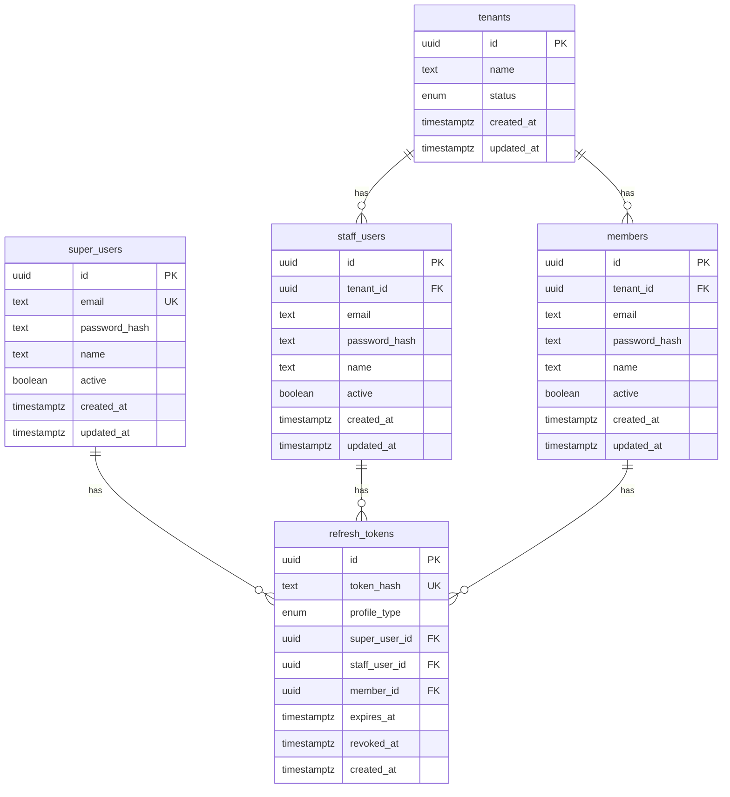

# GymBro — Esquema de base de datos

**Estado:** Viva (se actualiza con cada migración Prisma)  
**Fuente de verdad del código:** [`api/prisma/schema.prisma`](../api/prisma/schema.prisma)  
**Motor:** PostgreSQL 16 · ORM Prisma 6  

Documento **implementado** (tablas reales), no el modelo conceptual de [03-modelo-dominio.md](./03-modelo-dominio.md). Cuando agregues o cambies tablas, actualizá este archivo en la misma tarea.

---

## 1. Convenciones

| Tema | Valor |
|------|--------|
| IDs | `uuid` (`@db.Uuid`) |
| Nombres físicos | `snake_case` vía `@@map` / `@map` |
| Multi-tenant | Tablas de negocio con `tenant_id` → `tenants.id` (RN-TEN-001) |
| Timestamps | `created_at`, `updated_at` donde aplica |
| Soft delete | No (aún); `active` boolean en usuarios |
| Migraciones | `api/prisma/migrations/` (manuales en dev) |

---

## 2. Diagrama de relaciones (actual)



---

## 3. Enums

| Enum (Prisma) | Valores | Uso |
|---------------|---------|-----|
| `TenantStatus` | `ACTIVE`, `SUSPENDED` | Estado del gym (RN-TEN-002) |
| `AuthProfileType` | `SUPER`, `STAFF`, `MEMBER` | Dueño del refresh token (RN-ROL-005) |

---

## 4. Tablas

### 4.1 `tenants`

Gimnasio / estudio = tenant SaaS.

| Columna | Tipo | Notas |
|---------|------|--------|
| `id` | uuid PK | |
| `name` | text | |
| `status` | `TenantStatus` | default `ACTIVE` |
| `created_at` | timestamptz | |
| `updated_at` | timestamptz | |

**Relaciones:** 1→N `staff_users`, 1→N `members`.

---

### 4.2 `super_users`

Super Admin de plataforma (sin `tenant_id`, RN-ROL-001).

| Columna | Tipo | Notas |
|---------|------|--------|
| `id` | uuid PK | |
| `email` | text UK | |
| `password_hash` | text | bcrypt |
| `name` | text nullable | |
| `active` | boolean | default true |
| `created_at` / `updated_at` | timestamptz | |

---

### 4.3 `staff_users`

Staff de un gym. Email único **por tenant**.

| Columna | Tipo | Notas |
|---------|------|--------|
| `id` | uuid PK | |
| `tenant_id` | uuid FK → `tenants` | ON DELETE CASCADE · index |
| `email` | text | |
| `password_hash` | text | |
| `name` | text nullable | |
| `active` | boolean | |
| `created_at` / `updated_at` | timestamptz | |

**Unique:** `(tenant_id, email)`.

---

### 4.4 `members`

Afiliado (socio). Perfil separado del staff (RN-ROL-005). Email único **por tenant**.

| Columna | Tipo | Notas |
|---------|------|--------|
| `id` | uuid PK | |
| `tenant_id` | uuid FK → `tenants` | ON DELETE CASCADE · index |
| `email` | text | |
| `password_hash` | text | |
| `name` | text nullable | |
| `active` | boolean | |
| `created_at` / `updated_at` | timestamptz | |

**Unique:** `(tenant_id, email)`.

---

### 4.5 `refresh_tokens`

Refresh opaco hasheado (SHA-256). Un token pertenece a **un** perfil (solo una FK de dueño poblada).

| Columna | Tipo | Notas |
|---------|------|--------|
| `id` | uuid PK | |
| `token_hash` | text UK | |
| `profile_type` | `AuthProfileType` | |
| `super_user_id` | uuid FK nullable | |
| `staff_user_id` | uuid FK nullable | |
| `member_id` | uuid FK nullable | |
| `expires_at` | timestamptz | |
| `revoked_at` | timestamptz nullable | logout / rotación |
| `created_at` | timestamptz | |

---

## 5. Migraciones aplicadas

| Migración | Contenido |
|-----------|-----------|
| `20260718120000_init_tenant` | enum `TenantStatus` + tabla `tenants` |
| `20260718160000_auth_identities` | auth: enums, `super_users`, `staff_users`, `members`, `refresh_tokens` |

Comandos:

```powershell
docker compose exec api npm run prisma:migrate   # dev
docker compose exec api npx prisma migrate deploy
docker compose exec api npm run prisma:seed
```

---

## 6. Seed local (demo)

| Entidad | Valor |
|---------|--------|
| Tenant id | `00000000-0000-4000-8000-000000000001` (`Demo Gym`) |
| Super | `super@gymbro.local` |
| Staff | `admin@demo.gym` |
| Member | `socio@demo.gym` |
| Password (todos) | `ChangeMe123!` |

Script: [`api/prisma/seed.ts`](../api/prisma/seed.ts).

---

## 7. Pendiente de modelar (dominio → DB)

Aún no hay tablas Prisma para (ver [03](./03-modelo-dominio.md) / roadmap): sucursales, roles/permisos, servicios/packs, reservas, pagos/caja, acceso, rutinas, notificaciones, auditoría, etc. Se documentan aquí **al implementarlas**.

---

[Índice](./00-indice.md) · [Modelo de dominio (conceptual)](./03-modelo-dominio.md) · [Arquitectura](./06-arquitectura.md)
