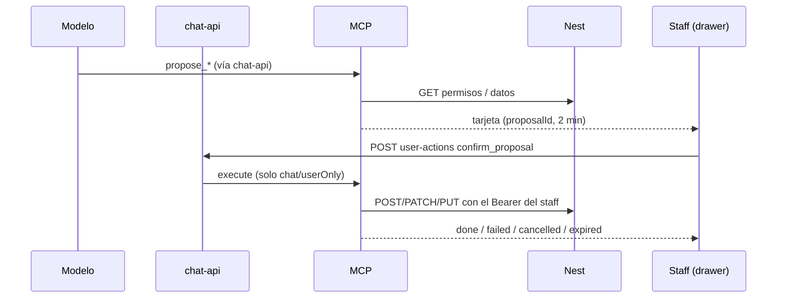

# Asistente: crear y editar con confirmación

**Fecha:** 2026-10-02
**Roadmap:** C8 — Escritura con confirmación (`docs/17-roadmap-chat-mcp.md`)
**Commit:** `89e95b3` — feat(asistente): crear y editar con confirmacion desde el chat
**Remote:** https://github.com/LucianoMocchegiani/gym-bro/commit/89e95b3

## Resumen

El asistente del Admin propone crear o editar gastos, afiliados, servicios, packs, clases (puntuales y series semanales), reservas con crédito, lista de espera, staff y roles. Muestra una tarjeta con el detalle y solo se ejecuta cuando el staff toca **Confirmar**. Lo que no hace (cobros, devoluciones, débito, puerta, config, borrar/cancelar, uploads) lo explica como una decisión de seguridad y lleva a la pantalla.

## Cambios principales

- MCP: 19 tools `propose_*` + `search_staff`; store de propuestas en memoria (2 min, un uso, dueño `tenantId:sub`); `confirm_proposal` con `_meta` `chat/userOnly`; `get_assistant_limits` + `instructions` del server.
- chat-api: el modelo no recibe tools `chat/userOnly`; `POST /v1/conversations/:id/user-actions` las ejecuta ante un clic y guarda la fila `tool`; `instructions` del MCP al system prompt Staff.
- Web: `ProposalCardView` en el drawer (Confirmar/Cancelar, vencida, resultado en la tarjeta, peligrosas con CONFIRMAR); disclaimer “No cambia nada sin que lo confirmes”.
- Nest: alta de socio/staff con `password` opcional → `ChangeMe123!` temporal (`TEMPORARY_PASSWORD`, compartido con la migración).

## Decisiones

- Confirmación genérica en chat-api por convención `_meta` (sigue sin saber de GymBro); la propuesta guarda el request exacto de Nest, no el modelo.
- Peligrosas (RN-ROL-007): estado del afiliado, staff con roles, asignar roles, roles. Subir cupo va solo por `/capacity` (promueve la lista de espera). Series: solo alta (desactivar = cancelar).
- Gasto con etiqueta inexistente → error + lista de etiquetas (no la crea).

## Validación

- `tsc` en `api`, `mcp`, `chat-api` y `web`; eslint en lo tocado de `web` y `api`.
- Prueba de punta a punta sin LLM contra API + MCP + chat-api locales (45 + 6 checks): confirmar, doble confirmación y otro staff → vencida, cancelar, permisos del Entrenador, contraseña temporal real al loguear, catálogo, clases, cupo, serie, rol, reserva sin crédito con mensaje de Nest, `user-actions` (400 tool común, 200 + persistencia). Datos de prueba borrados.
- Prueba manual con el LLM a cargo del usuario (`local/en-testeo/probar-asistente-escritura.md`). Deploy: rebuild de `api`, `mcp`, `chat-api`, `web` (sin migraciones).

## Diagrama

## Referencias

- [04-reglas-de-negocio.md](../04-reglas-de-negocio.md) (RN-ASI-001..004) · [16-chat-mcp-diseno.md](../16-chat-mcp-diseno.md) §15 · [17-roadmap-chat-mcp.md](../17-roadmap-chat-mcp.md) C8 · [08-casos-prueba-manuales.md](../08-casos-prueba-manuales.md) (C8-1..10) · [chat-api/docs/04-http.md](../../chat-api/docs/04-http.md)
- Commit: `89e95b3`
