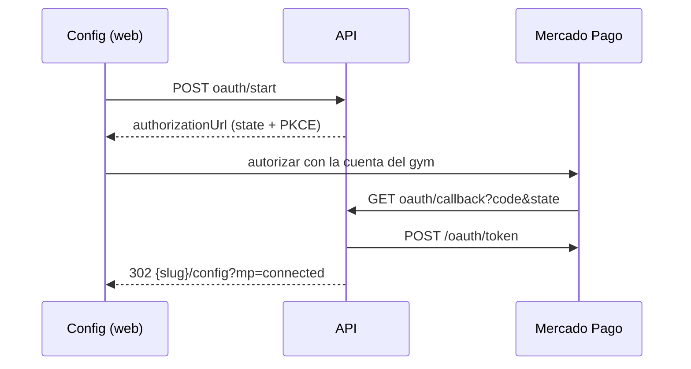

# Conectar Mercado Pago por OAuth

**Fecha:** 2026-10-03
**Roadmap:** E5 — Conectar cuenta MP del gym
**Commit:** `dd9da1a` — feat(mp): conectar Mercado Pago por OAuth (PKCE + renovacion diaria)
**Remote:** https://github.com/LucianoMocchegiani/gym-bro/commit/dd9da1a

## Resumen

Config tiene el botón **Conectar Mercado Pago**: el gym inicia sesión en MP con su cuenta y autoriza a la app de plataforma de Faciliter. No crea app, no copia claves y no configura webhooks. Los tokens se guardan cifrados y se renuevan solos. El token pegado quedó como «Conexión manual (avanzado)».

## Cambios principales

- `POST /api/mercadopago/account/oauth/start` (`mp.connect`): state de un uso (10 min, hash en `mp_oauth_states`) + PKCE S256.
- `GET /api/mercadopago/oauth/callback` público: canjea el código, guarda access/refresh token cifrados (`connection_mode = OAUTH`), audita `mp.account.connect` y vuelve a `{slug}/config?mp=connected|error`.
- Job diario 04:00 BA: renueva tokens que vencen en < 30 días (el refresh rota); si falla, `last_refresh_error` y Config pide «Reconectar».
- Estado con `connectionMode`, `tokenExpiresAt`, `needsReconnect`, `oauthAvailable`.
- Web Config: botón Conectar/Reconectar, avisos de vuelta, bloque manual plegado.
- Migración `20261003120000_mp_oauth`; env `MP_OAUTH_CLIENT_ID`, `MP_OAUTH_CLIENT_SECRET`, `MP_OAUTH_REDIRECT_URI`, `MP_OAUTH_PKCE`.

## Decisiones

- Una sola redirect URI en el API (MP no acepta comodines por subdominio); el tenant sale del `state`.
- Intentos en tabla (la API no usa Redis).
- App de plataforma de OAuth **separada** de `facilitermp` y sin webhook de panel: los avisos llegan por `notification_url`; un webhook con el tenant `admin` recibiría los pagos de todos los gyms.
- Manual queda escondido hasta probar OAuth (ticket local para sacarlo). Sin migración de gyms existentes: todos son de prueba.

## Validación

- `npx tsc --noEmit` y eslint en API y web.
- Prueba real pendiente del deploy y de crear la app de plataforma (`local/en-testeo/probar-mp-oauth.md`). Migración no corrida en local (base no accesible).

## Diagrama

## Referencias

- `docs/uso/configurar-mercadopago-tenant.md`, CU-PAG-006, RN-PAG-001, `06` §7.1b, `09` §4.15e.
- Commit: `dd9da1a` / https://github.com/LucianoMocchegiani/gym-bro/commit/dd9da1a
