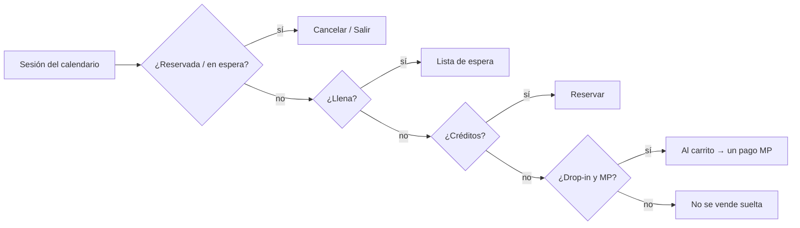

# Portal web del socio: clases, mis clases, carrito e historial

**Fecha:** 2026-10-03
**Roadmap:** Post-MVP — portal web del afiliado (fase 2: sesiones y compras)
**Commit:** `0423fe9` — feat(web): portal del socio con clases, mis clases, carrito e historial
**Remote:** https://github.com/LucianoMocchegiani/gym-bro/commit/0423fe9

## Resumen

`{slug}/cuenta` tiene ahora el mismo alcance de sesiones y compras que la app. El socio ve el calendario del mes: reserva con créditos y, si no tiene, suma la clase suelta al carrito. También se anota en la lista de espera, cancela desde «Mis clases», arma un carrito de packs y clases sueltas que paga con un solo Mercado Pago y ve el historial completo de comprobantes, con pedido de devolución por línea. Un socio que entra a `/comprar` suma el pack a su carrito. No cambió la API.

## Cambios principales

- Route group `app/cuenta/(portal)` con las rutas `clases`, `mis-clases`, `tienda`, `carrito` e `historial`. Su layout resuelve el gym del host (`lib/gym-site.ts`) y monta `MemberArea`: exige sesión de socio, muestra el menú y comparte el contexto.
- `useMemberBooking`, equivalente web de `SessionBookingMixin`: créditos, reservas, lista de espera, drop-in al carrito y confirmaciones.
- Componentes del portal: `MonthCalendar`, `SessionSlotCard`, `MemberClasses`, `MyClasses`, `MemberStore`, `MemberCartView` y `MemberHistory`. El inicio (`MemberPortal`) muestra próximas clases y planes vigentes.
- Carrito en `lib/member-cart.ts` (localStorage `gymbro.member.cart`, cuyo dueño es `tenantId:memberId`). Se vacía al pagar y al salir.
- Reutilización:
  - `lib/local-store.ts` es la base de `token-store` y del carrito;
  - `CartLineList` se comparte con Caja;
  - `ReceiptPanel` suma una acción por línea;
  - las fechas de sesión salen de `lib/format-session.ts`;
  - la redirección a MP sale de `lib/mp-checkout.ts`;
  - las líneas del pack, de `storePackItems`.
- `lib/api/member-portal.ts` cubre los `/me/*` de sesiones, reservas, espera, recibos y devoluciones. El checkout pasa a ser el del carrito (`startMyCartCheckout`).

## Decisiones

- Mismos endpoints y reglas que la app (RN-CTA-009). Documentos, avisos y ajustes quedan para otros tickets.
- El carrito vive en el navegador, como en la app, sin tabla nueva.
- Las próximas reservas salen de `account.reservations`, para no depender de la hora del cliente.

## Validación

- `tsc --noEmit` de la web pasa (ignorando los tipos viejos de `.next`) y `next build` también.
- Pasé eslint por los archivos tocados y no tienen errores nuevos. Los `set-state-in-effect` que quedan en `caja/page.tsx` ya estaban.
- Prueba manual pendiente: `local/en-testeo/portal-socio-sesiones.md` y casos G15–G24 de `docs/08`.

## Diagrama

## Referencias

- RN-CTA-008/009, CU-RES-001/003/004, CU-PAG-001/004, CU-AFI-007, `06` (web del gym), `08` G11b y G15–G24, `web/README.md`, `mcp/help/app.md`.
- Commit: `0423fe9` / https://github.com/LucianoMocchegiani/gym-bro/commit/0423fe9
