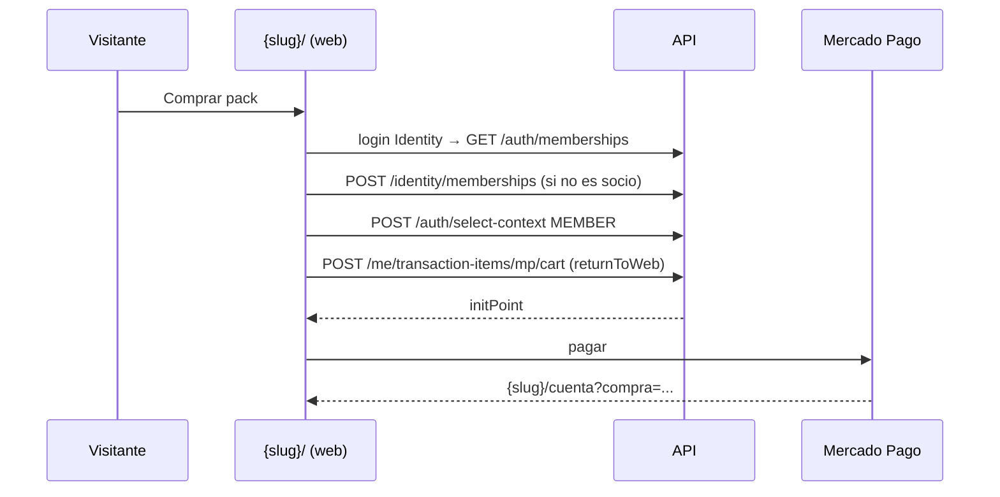

# Web del gym: vidriera, login único, compra self-service y portal del socio

**Fecha:** 2026-10-03
**Roadmap:** Post-MVP — portal web del afiliado (fase 1)
**Commit:** `6a20846` — feat(web): web del gym con vidriera, login único, compra self-service y portal del socio
**Remote:** https://github.com/LucianoMocchegiani/gym-bro/commit/6a20846

## Resumen

`{slug}.faciliter.xyz/` pasó a ser la web pública del gym, con sus packs y un botón **Comprar** si el gym conectó Mercado Pago. El panel staff se mudó a `/dashboard`. Staff y socios entran por el mismo `/login` con la cuenta Faciliter: el staff va al panel, el socio a `/cuenta` y quien es las dos cosas elige. Una persona sin cuenta en el gym puede registrarse, darse de alta como socia (nombre, DNI, teléfono) y pagar en Mercado Pago. Al volver ve el resultado del pago, sus packs vigentes y sus comprobantes.

## Cambios principales

- Panel en `web/app/dashboard/...`. El middleware redirige con 308 las rutas viejas (`/caja`, `/puerta/...`, `/config?mp=`) y manda la raíz de `admin` al apex. La URL de vuelta del OAuth de MP, el débito y el plan apuntan a las rutas nuevas (`api/src/common/web-urls.ts`).
- `GET /api/public/tenants/by-slug/:slug/packs` (sin auth): packs activos + `onlineCheckout`. Reutiliza `TenantsService`, `PacksService` y `MercadoPagoAccountService`.
- `POST /api/identity/memberships` (JWT Identity): alta self-service del socio ACTIVE, con auditoría `member.self_join` (CU-AFI-007, RN-CTA-007).
- `POST /me/transaction-items/mp/cart` acepta `returnToWeb`: la preferencia lleva `back_urls` a `{slug}/cuenta?compra=` (`auto_return` solo con https).
- Web: factory `token-store` para las sesiones staff, socio e Identity. `apiRequest({ auth })` elige la sesión. `gym-context` resuelve los perfiles del gym y entra con `select-context`. El logout del gym cierra las tres sesiones.
- Páginas `/` (vidriera SSR indexable), `/login` (único), `/comprar` (alta + pago) y `/cuenta` (portal). `MarketingFrame` y `PackPlanCard` se comparten con la landing del apex.
- Links del MCP y de la ayuda migrados a `/dashboard/...`. La guía tiene una sección nueva sobre la web del gym.

## Decisiones

- Todo vive en el mismo host del gym: la vidriera en `/` y el panel en `/dashboard`, igual que en el apex de Faciliter.
- El botón Comprar aparece solo si el gym tiene MP conectado. Si no, el pack dice «Se contrata en el gym».
- El alta pide DNI para no duplicar socios. Si el DNI ya está usado devuelve 409; un socio suspendido no puede comprar (403).
- Portal mínimo. El calendario y las reservas web van en otro ticket.

## Validación

- `tsc --noEmit` pasa en API, web y MCP (en la web solo quedan errores de los tipos viejos de `.next`).
- Pasé eslint por los archivos nuevos y no tienen errores. Los errores que siguen (set-state-in-effect, prettier) son de líneas que ya estaban así.
- Prueba manual pendiente: `local/en-testeo/portal-web-afiliado.md` y casos G1–G14 de `docs/08`.

## Diagrama

## Referencias

- CU-AFI-007, RN-CTA-005..008, `06` §5 y §7.2, `08` sección «Web del gym», `web/README.md`, `mcp/help/guia.md`.
- Commit: `6a20846` / https://github.com/LucianoMocchegiani/gym-bro/commit/6a20846
